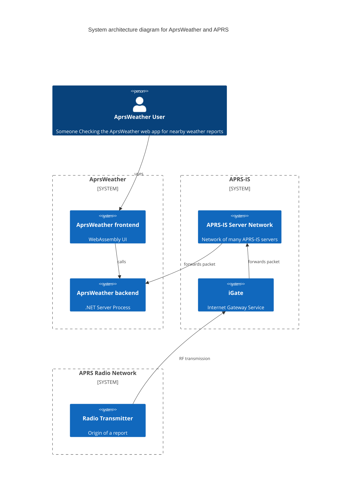
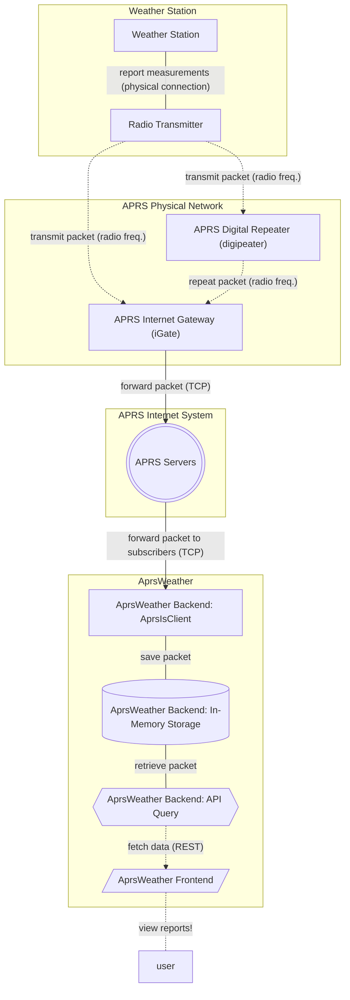

# AprsWeather

Weather maps backed by data from the Automatic Packet Reporting System (APRS).

Deployed at: [hamwx.bielstein.dev](https://hamwx.bielstein.dev)

## Diagrams

As the [Automatic Packet Reporting System](http://aprs.org/) and its component
[Automatic Packet Reporting System - Internet Service](https://aprs-is.net/) may not be familiar to
all who wish to work on this project, I've included a few diagrams on the architecture of this app,
how it relates to existing APRS infrastructure, and how data will typically flow through the full
system.

### Architecture

This diagram lays out the following pieces:

1. AprsWeather frontend (WebAssembly in the browser for visualization)
2. AprsWeather backend (web server receiving and storing APRS packets from the APRS-IS and serving to frontend via a RESTful API)
3. APRS-IS servers streaming data via TCP
4. APRS iGate radio stations receiving and decoding packets from radio transmissions

### Data Flow Example

This diagram lays out a a flow for a weather report to move through the APRS, APRS-IS, and AprsWeather
systems from the weather station to the end user.
Steps are:

1. A weather station takes measurements
2. A radio transmitter encodes those measurements in an APRS data packet and transmits the packet over the air
3. An APRS iGate station receives the packet via antenna and receiver then decodes and forwards to the APRS-IS servers
4. APRS-IS server infrastructure forward messages through network
5. APRS-IS servers forward message to subscribed servers (based on [filters](https://aprs-is.net/javAPRSFilter.aspx)) via TCP connection
6. AprsWeather backend receives packet via TCP, decodes, and stores
7. AprsWeather frontend requests reports via REST API from backend and displays to user

## Running Locally

Before running, you'll have to set a value for the `APRS_IS_CALLSIGN` environment variable.
This value will be used for APRS-IS login.

### Docker Compose

The full application can be run locally using `docker compose up -d --build`.
Once that is complete, load `http://localhost:80` in your browser or use `http://localhost:5148/WeatherReports` to test the backend.

Once finished, it can be shut down with `docker compose down`.

**Note**: If running the client docker container directly, please add `--build-arg ENVIRONMENT=Development` to avoid including page view analytics code.

### Local/Debug

To run without docker containers, which is helpful for debugging or quickly iterating on UI changes, run the following steps:

1. Find and replace `%ENVIRONMENT%` with `Development` in [src/AprsWeatherClient/wwwroot/index.html](src/AprsWeatherClient/wwwroot/index.html). This uses the [development appsettings](src/AprsWeatherClient/wwwroot/appsettings.Development.json) file when running the client. Careful not to commit this change in git.
2. Launch the frontend and backend by opening a terminal for each the server and client, changing to each directory (i.e. `src/AprsWeatherClient` and `src/AprsWeatherServer`), and executing `dotnet run` or `dotnet watch`, as desired.
3. Point your browser to `http://localhost:5184/`

## Deploying

This application deploys with [DigitalOcean App Platform](https://www.digitalocean.com/products/app-platform).
It has full continuous deployment for any code pushed/merged to `main`.

To bootstrap the deployment, use the [doctl](https://docs.digitalocean.com/reference/doctl/) command line to deploy the application.
Once deployed, take the application ID and save it as a GitHub Actions secret so it can be used for future updates and deployments.

## APRS Reports and Gridsquare Locations

Good resources for finding and viewing APRS reports and gridsquare locations (good for debugging):

* [Google Maps APRS (APRS.fi)](https://aprs.fi)
* [Amateur Radio Ham Radio Maidenhead Grid Square Locator Map](https://www.levinecentral.com/ham/grid_square.php)
* [GridMapper by QRZ Ham Radio](https://www.qrz.com/gridmapper)

## Analytics Reporting

Visitor analytics reporting is handled by [Plausible.io](https://plausible.io).
A script is added during deployment to report analytics data to them.
When forking this repository, please remove or update [src/AprsWeatherClient/deploy/analytics.sh](src/AprsWeatherClient/deploy/analytics.sh).
